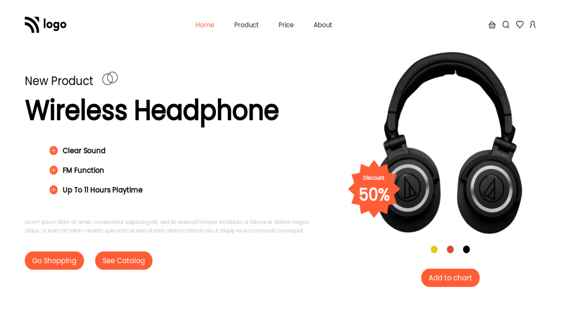

# Project 7

## `Nishok Maharaaj`

## Learnings    

In the seventh project of HTML and CSS class I have learnt mostly about positioning in CSS which is used mostly in alignment of the image and the text. Also done some colored circle shapes with plain div

## Efforts

This project took around 2 hours to build just because of the image and the alignment of icons around it.

### Screenshot

